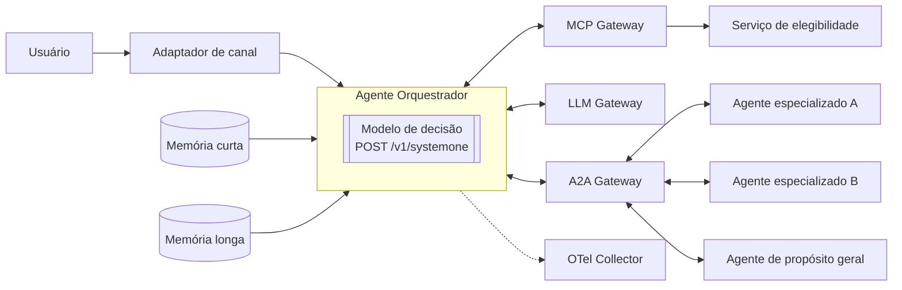

# 01 — Contexto arquitetural

Este documento descreve a arquitetura de referência em termos genéricos e só com os conceitos necessários ao experimento. O objetivo é deixar claro **onde** o modelo de decisão atua e **quais informações de contexto** ele recebe.

## Componentes da arquitetura de referência

| Componente | Papel | Relevância para o benchmark |
|------------|-------|-----------------------------|
| **Adaptador de canal** | Integra canais de interação (chat, mensageria, voz) e normaliza a entrada | Define o formato do enunciado que chega ao orquestrador |
| **Agente Orquestrador** | Supervisiona cada turno: identifica a intenção, aplica políticas, controla sessões e seleciona o agente | **Hospeda o modelo de decisão avaliado** |
| **A2A Gateway** | Registra agentes (cards) e faz autenticação, mediação de tarefas A2A, ciclo de vida de tarefas (IDs, estado, retomada, cancelamento), além de erros e timeouts | Fonte do catálogo de agentes, que vira o conjunto de opções de destino |
| **A2A Adapter** | Permite que agentes sem A2A nativo conversem com o orquestrador de forma padronizada | Fora de escopo, exceto como opção de destino |
| **Agentes especializados** | Agentes de domínio, um agente de propósito geral (por exemplo, com busca web) e outros | São as **classes de destino** do roteamento |
| **MCP Gateway / Server** | Expõe ferramentas e fontes de dados com contrato padronizado, *discovery*, autenticação e limites | Fonte de dados para pré-requisitos e para o **serviço de elegibilidade de intenções** |
| **Serviço de elegibilidade de intenções** | A partir das intenções mapeadas, identifica as que são elegíveis para um dado usuário | **Restringe as opções** apresentadas ao modelo de decisão |
| **LLM Gateway** | Centraliza o acesso a modelos (LLM, busca e modelos System 1), além de políticas, limites e telemetria | Ponto de integração natural do modelo de decisão em produção |
| **Memória curta** | Estado operacional da conversa e de cada sessão de agente (`conversation_id`, `session_id`/`task_id`, `agent_id`) | Fornece o **estado** (`state`) da requisição de decisão |
| **Memória longa** | Fatos e preferências duradouros entre sessões | Contexto opcional; avaliado só se fizer parte do `state` |
| **Base de personalização** | Atributos declarados e inferidos do usuário, com acesso governado | Fora de escopo no primeiro ciclo |
| **Observabilidade** | OpenTelemetry Collector, Pub/Sub, armazenamento de traces e logs, dashboards, avaliação de LLM e data lake | Modelo de telemetria usado pelo harness (latência, `run_id`, `model_id`) |

## Fluxo de um turno no orquestrador

1. Registrar a mensagem recebida, carregar o estado da conversa e carregar os atributos de contexto.
2. Aplicar os **guardrails de entrada**.
3. **Classificar e analisar a intenção.**
4. Seguir um destes ramos:
   - **rotear para o agente ativo** via A2A;
   - **executar os pré-requisitos** e **iniciar uma sessão com um novo agente** via A2A;
   - **preparar perguntas de pré-requisito**;
   - **preparar uma pergunta de desambiguação de intenção**.
5. Validar o retorno do agente.
6. Preparar a resposta e aplicar os **guardrails de saída**.
7. Registrar a mensagem e os estados.

## Pontos de decisão avaliados

O benchmark avalia os pontos de decisão em que um modelo System 1 substitui ou antecede uma chamada a um LLM generalista. Cada ponto vira uma **tarefa de decisão** com pergunta, opções e regra de decisão próprias. A definição completa está em [02-desenho-experimental.md](02-desenho-experimental.md).

| ID | Ponto de decisão | Etapa do fluxo | Tipo JEV previsto |
|----|------------------|----------------|-------------------|
| D1 | Classificação de intenção entre as intenções **elegíveis** | Passo 3 | `choice` |
| D2 | Continuidade de sessão: manter o agente ativo, retomar uma sessão suspensa, iniciar um novo agente ou desambiguar | Passo 4 | `choice` |
| D3 | Necessidade de desambiguação: a intenção está clara o suficiente para rotear? | Passos 3–4 | `noul` ou `score`, a confirmar (ver questões em aberto) |
| D4 | Várias intenções no mesmo enunciado: quais intenções estão presentes | Passo 3 | várias decisões sobre o mesmo texto (tarefa 65) |
| D5 | *(opcional)* Guardrail de entrada: dentro do escopo, fora do escopo ou bloqueado | Passo 2 | `choice` |

Ficam **fora de escopo**: geração de resposta, validação do retorno dos agentes, guardrails de saída, extração de atributos de personalização e o próprio protocolo A2A/MCP. A elegibilidade de intenções é **simulada**: o conjunto de opções elegíveis já vem pronto em cada exemplo.

## Requisitos não funcionais que derivam da arquitetura

- **Latência por turno.** O modelo roda em todos os turnos, no caminho síncrono do usuário. Por isso, p95 e p99 com lote 1 são a métrica operacional principal.
- **Contexto curto.** A decisão usa o enunciado e um resumo do estado (agente ativo, sessões abertas, últimos turnos), não o histórico completo.
- **Opções dinâmicas.** O conjunto de opções muda a cada usuário e a cada turno, por causa da elegibilidade e das sessões abertas. Os modelos precisam aceitar opções descritas em tempo de inferência, sem retreino.
- **Abstenção útil.** Quando a confiança é baixa, o melhor caminho é desambiguar, não errar a rota. A calibração e a acurácia seletiva são métricas de primeira classe.
- **Telemetria.** Cada decisão gera um registro compatível com OpenTelemetry (`run_id`, `model_id`, `latency_ms`, versão do adaptador).
