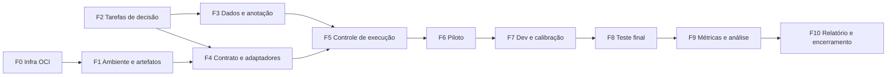

# 03 — Plano de tarefas

As 78 microtarefas mantêm a numeração original. As linhas **↳** registram a adaptação de cada tarefa ao contexto de roteamento e orquestração ou uma dependência importante. As referências *Qn* apontam para as decisões de projeto em [04-questoes-em-aberto.md](04-questoes-em-aberto.md).

As fases F0–F1 (infra) e F2–F3 (dados) podem andar em paralelo.

<!-- PROGRESSO:INICIO -->
**Andamento em 2026-10-07:** 40 de 78 tarefas concluídas (51%), 8 em andamento.

| Fase | Concluídas | Em andamento | Pendentes |
|------|-----------|--------------|-----------|
| F0 — Infraestrutura OCI | 6 | 2 | 2 |
| F1 — Ambiente e artefatos | 9 | 0 | 0 |
| F2 — Tarefas de decisão e taxonomia | 4 | 0 | 0 |
| F3 — Dados e anotação | 5 | 6 | 1 |
| F4 — Contrato JEV e adaptadores | 16 | 0 | 0 |
| F5 — Controle de execução | 0 | 0 | 3 |
| F6 — Piloto | 0 | 0 | 4 |
| F7 — Desenvolvimento e calibração | 0 | 0 | 4 |
| F8 — Teste final | 0 | 0 | 4 |
| F9 — Métricas e análise | 0 | 0 | 8 |
| F10 — Relatório e encerramento | 0 | 0 | 4 |
| **Total** | **40** | **8** | **30** |

Legenda: `[x]` concluída · `[~]` em andamento ou parcial · `[ ]` pendente.
<!-- PROGRESSO:FIM -->

---

## F0 — Infraestrutura OCI

- [x] **1.** Criar um compartment OCI dedicado ao benchmark.
  - ↳ `<compartimento-pai>/decision-models` (caminho em `.secrets/oci-settings.json`). Recursos em `us-chicago-1`. OCIDs em `.secrets/artefatos-OCI.md` (fora do Git).
- [~] **2.** Aplicar as tags `projeto=benchmark-decisoes-ptbr`, `ambiente=benchmark` e `centro_custo=<definir>` aos recursos do projeto. *(Q13)*
  - ↳ Parcial: `projeto` e `ambiente` aplicadas como tags livres por `infra/oci/provision.py`. Falta `centro_custo`.
- [ ] **3.** Criar um orçamento para o compartment.
  - ↳ **Em aberto por decisão (2026-10-07):** o uso está coberto por cota interna de engenharia. Não será criado no primeiro ciclo.
- [ ] **4.** Configurar alertas de orçamento em 50%, 80% e 100% do valor aprovado.
  - ↳ Em aberto, porque depende da tarefa 3.
- [x] **5.** Criar um projeto no OCI Data Science.
  - ↳ `benchmark-decisoes-ptbr`.
- [~] **6.** Criar buckets no Object Storage para `entrada`, `artefatos`, `resultados` e `logs-imutaveis`.
  - ↳ Criados com o prefixo `dmb-` (nomes de bucket são únicos no namespace), privados e com versionamento.
  - ↳ Pendente: a regra de retenção (WORM) de `dmb-logs-imutaveis`, que depende do prazo de retenção (tarefa 77).
- [x] **7.** Definir políticas IAM de menor privilégio para leitura dos dados, escrita dos resultados e execução dos jobs.
  - ↳ Sem acesso de administrador à tenancy, as políticas ficam no próprio compartment e não usam grupos nem dynamic groups.
  - ↳ `dmb-usuario-manager`: o usuário (filtrado por `request.user.id`) é *manager* das famílias data-science, object, virtual-network, logging, repos e generative-ai.
  - ↳ `dmb-jobs-menor-privilegio`: os jobs (`request.principal.type='datasciencejob'`) leem `dmb-entrada`/`dmb-artefatos`, escrevem em `dmb-resultados`/`dmb-logs-imutaveis`, usam logs e repos. Inclui a política de serviço do Data Science para a VCN.
- [x] **8.** Definir uma VCN privada para os jobs, com acesso ao Object Storage por Service Gateway.
  - ↳ `dmb-vcn` 10.20.0.0/16, sub-rede privada `dmb-subnet-jobs`. A rota e a security list só permitem tráfego para serviços OCI pelo Service Gateway.
- [x] **9.** Criar uma rota temporária de saída por NAT Gateway, só para a aquisição inicial de dependências e pesos.
  - ↳ Remover a rota logo após a tarefa 16 e passar pelo gate de egresso antes de qualquer execução. *(Q3)*
  - ↳ **Não foi necessário:** a aquisição (tarefas 13–16) rodou fora da VCN e enviou os artefatos direto ao bucket; os ambientes são montados por jobs de build com rede gerenciada. `infra/oci/nat.py` fica disponível.
  - ↳ Criar e ativar **só quando necessário**, com `infra/oci/nat.py on`. Para desligar: `nat.py off`, que fecha a rota e bloqueia o NAT. Na tarefa 78: `nat.py off --delete`.
- [x] **10.** Validar que os jobs acessam os buckets sem internet pública.
  - ↳ Validado em 2026-10-07 com jobs do Data Science em `dmb-subnet-jobs`. Os pesos do Rizzo (4,4 GB) desceram pela Service Gateway em 28 s, com SHA-256 conferido.

## F1 — Ambiente e artefatos

- [x] **11.** Criar uma imagem de contêiner base com Python, CUDA, PyTorch, Transformers, Hugging Face Hub e ferramentas de medição.
  - ↳ Incluir um exportador OpenTelemetry, para que a telemetria do harness tenha o mesmo formato da observabilidade do orquestrador.
  - ↳ **Substituído na prática por ambientes Python publicados no bucket** (`infra/ds/build_env.sh` → `dmb-artefatos/envs/<candidato>/`), porque os jobs do Data Science dispensam contêiner próprio. O CUDA vem das wheels `cu128` do PyTorch e o Python é o 3.11.9 base dos jobs.
  - ↳ `env/Dockerfile` com `--build-arg CANDIDATE=...`: **uma imagem por candidato**, porque o SemIf exige `transformers==5.17.0` e o GLiNER exige `transformers<5`. Os pesos ficam fora da imagem. Falta fazer o build e o push para o OCIR, na VM.
- [x] **12.** Fixar num manifesto as versões do sistema, dos drivers CUDA, do Python, das bibliotecas e da imagem de contêiner.
- [x] **13.** Baixar os pesos, tokenizadores, revisões e licenças aprovados de cada candidato. *(Q4)*
  - ↳ `env/acquire.py`: todas as licenças são Apache-2.0 ou MIT (incluindo o Qwen3.5-4B). Rizzo: GGUF Q8_0 (padrão do projeto) + llama.cpp b11081. **Não foi preciso NAT**: a aquisição rodou fora da VCN e enviou direto ao bucket.
  - ↳ A aquisição falha se a licença estiver fora da allowlist de `config/benchmark.yaml`. O contexto efetivo de cada candidato é medido e registrado.
  - ↳ Incluir as dependências específicas de cada candidato (pacote GLiNER, runtime SemIf, interface Rizzo Flow) e a revisão fixada de `Qwen/Qwen3.5-4B`.
- [x] **14.** Calcular o SHA-256 de cada artefato baixado.
- [x] **15.** Copiar os pesos e dependências aprovados para o bucket `artefatos`.
- [x] **16.** Registrar no manifesto a origem, a revisão, a licença, o hash, a data de aquisição e o tamanho de cada artefato.
- [x] **17.** Desabilitar a saída pública dos jobs de benchmark.
  - ↳ O gate de egresso foi aprovado nas execuções em sub-rede privada: huggingface.co, pypi.org e github.com ficaram inacessíveis.
- [x] **18.** Carregar cada candidato só a partir dos artefatos locais.
  - ↳ Usar `HF_HUB_OFFLINE=1`, `TRANSFORMERS_OFFLINE=1` e um cache apontado para os artefatos verificados.
  - ↳ `harness/job.py` baixa do bucket só o que está no manifesto e confere o SHA-256. Os quatro candidatos já carregaram offline, a partir dos artefatos locais.
- [x] **19.** Fazer o job falhar se algum candidato tentar baixar arquivos durante a inferência.
  - ↳ Duas camadas: as variáveis de ambiente offline e o bloqueio de rede da VCN. Um teste negativo prova que a falha ocorre.
  - ↳ Camada de aplicação em `dmb/offline.py` (bloqueia conexões fora do loopback), com teste em `tests/test_offline.py`. O gate de egresso de `harness/job.py` cobre a camada de rede.

## F2 — Tarefas de decisão e taxonomia

- [x] **20.** Definir a taxonomia de decisões a avaliar em PT-BR.
  - ↳ **Primeiro ciclo: só D1 (classificação de intenções), atendimento de telefonia móvel.** `data/taxonomy/intents-v1.yaml`: 42 intenções em 13 domínios + 5 categorias fora de escopo.
  - ↳ Taxonomia de **intenções** (D1), ligadas aos **agentes de destino** do catálogo A2A, mais as decisões de **continuidade de sessão** (D2), **desambiguação** (D3) e **várias intenções** (D4). D5 é opcional. Ver [02 §2](02-desenho-experimental.md#2-tarefas-de-decisão).
- [x] **21.** Escrever a pergunta, as opções, as descrições das opções e a regra de decisão de cada tarefa.
  - ↳ As descrições das opções seguem o estilo de um *agent card*: curtas e orientadas à capacidade do agente.
- [x] **22.** Limitar o primeiro ciclo a no máximo 20 opções por questão, para garantir compatibilidade com o Laya. *(Q2)*
  - ↳ Os subconjuntos de opções por exemplo simulam o serviço de elegibilidade de intenções.
  - ↳ **Limite efetivo: 16 opções**, por causa do SemIf (Q2).
- [x] **23.** Incluir uma opção explícita de `outro` ou `sem correspondência` quando a taxonomia não for exaustiva.

## F3 — Dados e anotação

- [x] **24.** Coletar textos PT-BR representativos do domínio de destino. *(Q7, Q15)*
  - ↳ **100% sintéticos** (`datagen.generate`, na VM): 4.068 enunciados em 339 lotes (42 intenções × 7 perfis + 5 categorias fora de escopo × 9 lotes), geradores `llama-4-maverick` e `command-a` alternados.
  - ↳ A unidade é a **conversa com vários turnos**, não o enunciado isolado. Cada turno guarda o estado (agente ativo e sessões suspensas).
- [x] **25.** Remover ou mascarar dados pessoais, segredos e identificadores que o benchmark não precisa.
- [~] **26.** Separar os textos por domínio, comprimento, grau de ambiguidade e classe esperada.
  - ↳ Acrescentar a posição do turno e a presença de agente ativo ou de sessões suspensas.
  - ↳ Primeiro ciclo (só D1): metadados `domain`, `length_bucket`, `ambiguity`, `profile`, `sentiment`, `kind` e `n_options` gravados por `datagen.build`.
- [x] **27.** Criar exemplos adversariais com abreviações, erros de ortografia, regionalismos, textos curtos e várias intenções.
  - ↳ Acrescentar respostas curtas que dependem do contexto ("sim", "o segundo"), troca de assunto, retorno a um assunto anterior e pedidos fora de escopo.
  - ↳ Perfis de geração: informal/abreviado, erros de digitação, regionalismo, emocional, longo, indireto/múltiplo; fora de escopo em 5 categorias (inclui desabafo emocional sem pedido).
- [x] **28.** Definir os critérios de inclusão e exclusão dos exemplos.
  - ↳ Exclui: duplicatas exatas e aproximadas, comprimento fora de 2–700 caracteres, três rótulos distintos na anotação e falha de anotação. Resultado do `prepare`: 4.057 de 4.068 mantidos (9 duplicatas exatas, 2 aproximadas; 4 trechos mascarados).
- [x] **29.** Produzir o guia de anotação humana.
  - ↳ [06-guia-de-anotacao.md](06-guia-de-anotacao.md), usado literalmente pelos anotadores.
  - ↳ O guia cobre D1–D4 com exemplos-limite (por exemplo, quando um enunciado curto continua a tarefa do agente ativo e quando inicia um novo agente).
- [~] **30.** Anotar cada exemplo com dois avaliadores independentes.
  - ↳ Avaliadores = modelos generativos em rodízio (`openai.gpt-5.5`, `google.gemini-2.5-pro`, `xai.grok-4.3`). *(Q15)*
- [~] **31.** Resolver as discordâncias com a revisão de um terceiro avaliador.
- [~] **32.** Registrar, para cada exemplo, a resposta de referência, a justificativa e a versão da taxonomia.
  - ↳ Reportar também a concordância entre anotadores.
- [~] **33.** Separar os dados em desenvolvimento, calibração e teste final por grupo de origem. *(Q12)*
  - ↳ O grupo é `group_id`, ou seja, a conversa.
- [~] **34.** Impedir que textos derivados do mesmo caso apareçam em mais de uma partição.
- [ ] **35.** Congelar o conjunto de teste final antes de qualquer ajuste de parâmetros.
  - ↳ Registrar o hash do arquivo congelado e guardar uma cópia em `logs-imutaveis`.

## F4 — Contrato JEV e adaptadores

- [x] **36.** Criar um formato canônico de entrada com `id`, `state`, `question`, `options`, `gold_label` e metadados.
  - ↳ Ver [02 §3](02-desenho-experimental.md#3-formato-canônico-de-entrada-tarefa-36), que inclui a **regra única de serialização** de `state`.
- [x] **37.** Definir a versão do contrato JEV compatível a usar no benchmark: `POST /v1/systemone`, esquema de requisição, esquema de resposta e códigos de erro. *(Q1)*
  - ↳ Versão `jev-compat-v1`. Os esquemas já estão em `contracts/jev/schemas/`; falta revisar os códigos de erro no código dos adaptadores.
- [x] **38.** Definir o mapeamento obrigatório entre o contrato JEV e os tipos internos `choice`, `noul` e `score`.
- [x] **39.** Definir a regra de conversão de probabilidades, confiança, níveis ordinais, opções descritas e campos de uso.
- [x] **40.** Definir o comportamento padronizado para entradas inválidas, limite de contexto, timeout, opção desconhecida e indisponibilidade do modelo.
  - ↳ Na prática, uma falha do modelo de decisão vira desambiguação ou fallback no orquestrador. No benchmark, essas falhas contam como erro e são reportadas à parte.
- [x] **41.** Criar testes de conformidade com requisições e respostas JEV congeladas.
  - ↳ `contracts/jev/fixtures/conformance.json` + `tests/` (35 testes).
- [x] **42.** Criar um adaptador JEV local para o Laya com o checkpoint multilíngue fixado.
- [x] **43.** Criar um adaptador JEV local para o SemIf em modo `direct`, com a revisão do Qwen fixada.
- [x] **44.** Criar um adaptador JEV local para o GLiNER Decide usando `classify_text`.
- [x] **45.** Criar um adaptador JEV local para o Rizzo Flow usando sua interface de decisões. *(Q4)*
- [x] **46.** Expor cada adaptador no mesmo caminho local `POST /v1/systemone`, sem dependência de rede externa.
- [x] **47.** Garantir que cada adaptador devolva a resposta JEV completa, incluindo escolha, distribuição de probabilidades, confiança e metadados de uso, quando disponíveis.
- [x] **48.** Normalizar as saídas adicionais de execução num registro interno com `latency_ms`, `model_id`, `run_id` e versão do adaptador.
  - ↳ O registro é emitido como span OpenTelemetry e também gravado em arquivo de resultados.
- [x] **49.** Validar que os adaptadores preservam a mesma ordem e a mesma descrição das opções.
- [x] **50.** Validar que trocar de candidato não altera a requisição JEV nem o formato da resposta JEV.
- [x] **51.** Implementar testes de sanidade com decisões triviais, opções permutadas e os três tipos de pergunta.
  - ↳ Incluir um teste de invariância à permutação das opções em D1 e D2 (a mesma escolha com outra ordem).
  - ↳ `harness/sanity.py`. Primeira rodada em CPU (2026-10-07): sem violações de contrato nos 4 candidatos. Acertos: SemIf 8/8, Laya 7/8, Rizzo 7/8, GLiNER 5/8. Invariância à permutação: 4/4 em todos. Os próximos testes rodam na OCI.

## F5 — Controle de execução

- [ ] **52.** Fixar seeds, ordem dos exemplos, tamanho de lote, precisão numérica e limites de tokens de cada execução.
- [ ] **53.** Definir uma política de truncamento comum para textos maiores que o menor contexto efetivamente suportado. *(Q8)*
  - ↳ Truncar primeiro os turnos mais antigos do `state`. O enunciado atual nunca é truncado.
- [ ] **54.** Registrar o número de tokens de cada entrada antes de executar os modelos.

## F6 — Piloto

- [ ] **55.** Executar um piloto de 50 exemplos por candidato em CPU.
  - ↳ Sanidade em CPU (us-chicago-1, sub-rede privada) aprovada nos 4 candidatos: Laya 125 ms, GLiNER 194 ms, Rizzo Flow 7,3 s, SemIf 16,4 s (latência mediana). *(Q11)*
- [ ] **56.** Executar um piloto de 50 exemplos por candidato em GPU.
  - ↳ GPU em **sa-saopaulo-1, A10.1**, uma por vez *(Q14)*. Sanidade em GPU: Laya 21 ms, GLiNER 16 ms, SemIf 66 ms (latência mediana). Rizzo Flow exigiu compilar o llama.cpp com CUDA para a glibc da imagem dos jobs (`infra/ds/build_llama_cuda.sh`).
- [ ] **57.** Medir memória de GPU, memória RAM, tempo de carga, tempo de aquecimento e falhas do piloto.
- [ ] **58.** Ajustar apenas os parâmetros operacionais necessários para eliminar falhas de execução.

## F7 — Desenvolvimento e calibração

- [ ] **59.** Executar os candidatos no conjunto de desenvolvimento, sem calibração adicional.
- [ ] **60.** Escolher os limites de confiança e as regras de abstenção só com a partição de calibração.
  - ↳ Abster-se significa encaminhar para desambiguação. A regra é escolhida por meta de cobertura ou de risco, definida antes. *(Q5)*
- [ ] **61.** Calibrar as probabilidades separadamente por candidato, quando aplicável. *(Q10)*
- [ ] **62.** Não alterar prompts, opções, pesos ou limiares depois da abertura do conjunto de teste final.
  - ↳ Marco de congelamento: registrar os hashes da configuração, dos calibradores e dos adaptadores.

## F8 — Teste final

- [ ] **63.** Executar uma rodada de acurácia no teste final com lote 1.
- [ ] **64.** Executar uma rodada de acurácia no teste final com o lote de produção definido. *(Q6)*
- [ ] **65.** Executar uma rodada de várias decisões sobre o mesmo texto, quando esse padrão existir no caso de uso.
  - ↳ Corresponde a D4 e a combinações por turno (por exemplo, D2 + D1). Medir a latência somada por turno.
- [ ] **66.** Repetir cada medição de desempenho depois do aquecimento, em pelo menos três execuções independentes.

## F9 — Métricas e análise

- [ ] **67.** Coletar accuracy, macro F1, precision, recall e matriz de confusão.
  - ↳ Acrescentar a taxa de rota errada com confiança alta.
- [ ] **68.** Coletar Brier score, ECE, cobertura e acurácia seletiva quando houver probabilidades ou abstenção.
- [ ] **69.** Coletar latência p50, p95 e p99, vazão, uso de GPU, uso de RAM e consumo de armazenamento.
  - ↳ Reportar a latência por decisão e por turno.
- [ ] **70.** Calcular o custo estimado por mil decisões em cada cenário de execução.
- [ ] **71.** Criar cortes dos resultados por domínio, número de opções, comprimento e dificuldade do texto.
  - ↳ Acrescentar os cortes por tarefa de decisão, posição do turno, com ou sem agente ativo e categoria adversarial.
- [ ] **72.** Inspecionar manualmente os erros de alto impacto e as discordâncias entre os modelos.
- [ ] **73.** Classificar os erros em: taxonomia, contexto insuficiente, ambiguidade, linguagem, truncamento, instrução ou desempenho do modelo.
- [ ] **74.** Gerar tabelas comparativas e gráficos a partir dos arquivos de resultados versionados. *(Q9)*
  - ↳ Incluir intervalos de confiança (bootstrap) e testes pareados entre candidatos.

## F10 — Relatório e encerramento

- [ ] **75.** Elaborar o relatório técnico com configuração, limitações, resultados e recomendação.
- [ ] **76.** Anexar ao relatório os manifestos de artefatos, hashes, configurações, logs, testes de conformidade e comandos de reprodução.
- [ ] **77.** Arquivar os conjuntos congelados e os resultados no Object Storage com retenção definida.
- [ ] **78.** Desligar notebooks, jobs, endpoints temporários e o NAT Gateway que não sejam mais necessários.
