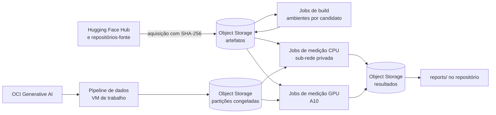

# 05 — Cenário de execução

O benchmark roda inteiro na Oracle Cloud Infrastructure (OCI). A máquina local serve só para editar o código, versionar e disparar as execuções.

## Visão geral



| Etapa | Onde roda | O que produz |
|-------|-----------|--------------|
| Aquisição de artefatos | Fora da rede dos jobs (`env/acquire.py`) | Pesos, tokenizadores, código-fonte e runtimes nas revisões fixadas, no bucket `dmb-artefatos`, com SHA-256 em `env/artifacts-manifest.json` |
| Ambientes dos candidatos | Jobs de build do OCI Data Science, com acesso à internet (`infra/ds/build_env.sh`) | Um ambiente Python por candidato (versões de `env/requirements/`), publicado em `dmb-artefatos/envs/<candidato>/` com manifesto de versões |
| Dados sintéticos | VM de trabalho, chamando o OCI Generative AI (`datagen/`) | Partições congeladas em `data/splits/` e em `dmb-entrada` / `dmb-logs-imutaveis` |
| Medições em CPU | Jobs do OCI Data Science em **us-chicago-1**, `VM.Standard.E4.Flex` com 8 OCPU e 64 GB, em sub-rede privada sem saída para a internet | Predições e resumos em `dmb-resultados` |
| Medições em GPU | Jobs do OCI Data Science em **sa-saopaulo-1**, `VM.GPU.A10.1`, um por vez | Predições e resumos em `dmb-resultados-gru` |
| Análise e relatórios | VM de trabalho ou notebook do Data Science | `reports/` no repositório |

## Isolamento durante as medições

Toda inferência roda **sem acesso a fontes externas**:

- **Artefatos verificados.** O job baixa do bucket só o que está no manifesto e confere o SHA-256 de cada arquivo e do ambiente do candidato.
- **Bloqueio no processo** (`dmb/offline.py`). Variáveis offline do Hugging Face e bloqueio de conexões fora do loopback. Um autoteste a cada execução (`process_guard`) prova que o bloqueio está ativo.
- **Bloqueio na rede (CPU).** A sub-rede privada só alcança os serviços OCI pela Service Gateway. O gate de egresso de `harness/job.py` confirma que nenhum host público responde.
- **GPU.** Os jobs usam a rede gerenciada do serviço. O isolamento vem do bloqueio no processo e do autoteste (`DMB_ISOLATION=app`). Pesos e ambientes ficam em `dmb-artefatos-gru`, uma réplica server-side do bucket principal (`infra/oci/replicate.py`).

## Fluxo de uma execução

1. `infra/ds/jobs.py` (CPU) ou `infra/ds/gpu_queue.py` (GPU) empacota o repositório num zip, sem `.secrets/` e sem `models/`, e cria o job.
2. `harness/job.py` (processo pai, Python base do serviço): gate de egresso, download e verificação dos pesos e do ambiente.
3. O processo filho, no ambiente do candidato, roda `harness.sanity` ou `harness.evaluate` com o bloqueio de rede ativo.
4. O processo pai envia predições, resumos e logs para o bucket de resultados.
5. `infra/ds/collect.py` traz os resumos para `reports/<etapa>/`, com uma tabela comparativa.

## Runtimes por candidato

| Candidato | Runtime |
|-----------|---------|
| Laya, GLiNER | PyTorch 2.10 (wheels `cu128`), transformers 4.57 |
| SemIf | PyTorch 2.10 (wheels `cu128`), transformers 5.17 (exigência do SemIf) |
| Rizzo Flow | llama.cpp b11081 (commit fixado pelo Rizzo). CPU: binário oficial. GPU: o mesmo commit compilado para a imagem dos jobs (`infra/ds/build_llama_cuda.sh`, CUDA 12.8) |

## Comandos principais

```bash
# medição em CPU (sub-rede privada)
PYTHONPATH=infra/oci .venv/bin/python infra/ds/jobs.py run --name <nome> --entrypoint infra/ds/run_job.sh \
    --private --ocpus 8 --memory 64 --env DMB_CANDIDATE=<candidato> DMB_MODE=evaluate DMB_SPLIT=dev [--wait]

# medição em GPU (fila em sa-saopaulo-1)
PYTHONPATH=infra/oci:infra/ds .venv/bin/python infra/ds/gpu_queue.py evaluate laya gliner semif rizzo_flow \
    --env DMB_SPLIT=dev

# resultados para o repositório
PYTHONPATH=infra/oci .venv/bin/python infra/ds/collect.py --split dev --dest reports/<etapa>

# pipeline de dados (na VM de trabalho, a partir da máquina local)
infra/vm/remote.sh run 'python -m datagen.generate --out /data/runs/datagen-v1'   # depois prepare, annotate, build
```

## Ciclo de vida dos recursos

Os recursos da OCI existem só durante o ciclo de medição. `infra/oci/provision.py` cria o compartment, as políticas, a rede, os buckets e o projeto do Data Science; `env/acquire.py` e `infra/ds/build_env.sh` publicam artefatos e ambientes; `infra/oci/teardown.py` remove tudo ao final. O ciclo `d1-v1` foi encerrado com o deprovisionamento completo: o registro permanente está neste repositório, e os dados brutos e os logs de execução ficam numa cópia local fora do Git (`data/raw/`, `runs/`).

## Configuração local sensível

Ficam fora do Git, em `.secrets/`: credenciais OCI e do GitHub, chaves SSH, o catálogo de recursos com OCIDs e `oci-settings.json` (compartimento pai e CIDR autorizado para SSH). O teste `tests/test_sensitive.py` falha se OCIDs, chaves, IPs públicos ou valores de `.secrets/` aparecerem em arquivos versionados.
