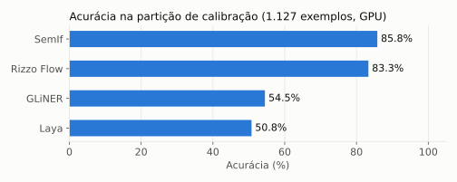
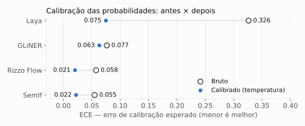
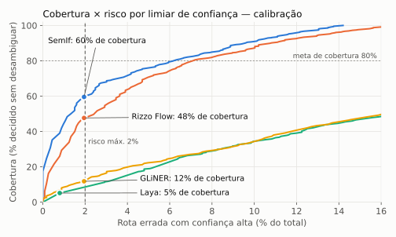

# Calibração — partição de calibração (1.127 exemplos)

## Sumário executivo

Nesta etapa, os quatro candidatos rodaram sobre a partição de calibração, e dela saíram os dois parâmetros que cada um leva para o teste final: uma **temperatura** que torna as probabilidades confiáveis e um **limiar de confiança** abaixo do qual o orquestrador pede esclarecimento ao usuário, em vez de rotear.

- **Qualidade:** SemIf (**85,8%**) e Rizzo Flow (**83,3%**) mantêm a liderança do piloto. GLiNER (54,5%) e Laya (50,8%) ficam bem atrás; no conjunto maior, o Laya fica abaixo do que o piloto sugeria.
- **Calibração:** a temperatura melhorou a calibração dos quatro. O ganho maior foi no Laya, cujo erro de calibração (ECE) caiu de 0,33 para 0,08. SemIf e Rizzo terminam muito bem calibrados (ECE 0,02).
- **Abstenção com risco controlado:** limitando a 2% as rotas erradas com confiança alta, o SemIf decide sozinho **60%** dos casos (com 96,7% de acerto nesses casos) e o Rizzo Flow **48%** (95,9%). GLiNER (12%) e Laya (5%) quase sempre precisariam pedir esclarecimento.
- **Critério pré-registrado de risco (H2):** exige cobertura ≥ 80% com risco ≤ 2%, e **nenhum candidato atinge**. Para chegar a 80% de cobertura, SemIf e Rizzo aceitariam de 6% a 7% de rotas erradas com confiança alta.
- **Consequência:** a temperatura e o limiar ficam congelados por candidato (`config/calibration.json`, tag `congelamento-d1-v1`) e são aplicados sem alteração ao teste final.

## Resultados gerais

| Candidato | Acurácia | ECE bruto → calibrado | Temperatura | Limiar | Cobertura com risco ≤ 2% | Acurácia nos casos decididos | Risco para cobertura de 80% |
|---|---|---|---|---|---|---|---|
| SemIf | 85,8% | 0,055 → 0,022 | 1,28 | 0,915 | 59,5% | 96,7% | 6,1% |
| Rizzo Flow | 83,3% | 0,058 → 0,021 | 1,25 | 0,924 | 47,6% | 95,9% | 7,1% |
| GLiNER | 54,5% | 0,077 → 0,063 | 0,82 | 0,857 | 11,8% | 83,5% | 32,1% |
| Laya | 50,8% | 0,326 → 0,075 | 3,58 | 0,872 | 5,1% | 84,5% | 34,5% |

*(GPU A10. Em CPU, Laya e GLiNER chegam às mesmas temperaturas e limiares.)*

Cada curva mostra, para um candidato, quanto ele decide sozinho (cobertura) em troca de quantas rotas erradas com confiança alta, à medida que o limiar baixa. O ponto marcado é o limiar escolhido: a maior cobertura com no máximo 2% de risco. Quanto mais a curva sobe à esquerda, melhor.

| Candidato | `sem_correspondencia` reconhecido | Acerto dentro do escopo | Pedidos válidos marcados como `sem_correspondencia` |
|---|---|---|---|
| SemIf | 68,8% | 90,3% | 32 |
| Rizzo Flow | 48,7% | 92,4% | 8 |
| GLiNER | 59,0% | 53,3% | 226 |
| Laya | 22,2% | 58,2% | 29 |

## Resultados detalhados

Probabilidades brutas (antes da calibração). Lote 1. As latências excluem os 5 primeiros exemplos (aquecimento). SemIf e Rizzo Flow rodam só em GPU, porque são inviáveis em CPU pela regra do piloto.

<!-- TABELA:INICIO -->
| Candidato | Disp. | Precisão | n | Acurácia | Macro F1 | ECE (bruto) | p50 ms | p95 ms | p99 ms | Carga s | RAM pico MiB | GPU pico MiB | Erros | Truncados |
|---|---|---|---|---|---|---|---|---|---|---|---|---|---|---|
| gliner | cpu | float32 | 1127 | 54.5% | 54.2% | 0.077 | 257.1 | 493.9 | 601.4 | 20.1 | 3240 | — | 0 | 0 |
| gliner | cuda | float32 | 1127 | 54.5% | 54.2% | 0.077 | 18.7 | 31.6 | 33.5 | 21.6 | 3252 | 1783 | 0 | 0 |
| laya | cpu | float32 | 1127 | 50.5% | 52.9% | 0.330 | 162.6 | 209.8 | 269.9 | 9.3 | 2681 | — | 0 | 0 |
| laya | cuda | float32 | 1127 | 50.8% | 53.3% | 0.326 | 21.5 | 22.8 | 24.0 | 9.9 | 2787 | 1811 | 0 | 0 |
| rizzo_flow | cuda | gguf-q8_0 | 1127 | 83.3% | 86.5% | 0.058 | 112.3 | 179.3 | 183.5 | 5.3 | 4528 | 5115 | 0 | 0 |
| semif | cuda | bfloat16 | 1127 | 85.8% | 88.1% | 0.055 | 117.2 | 184.2 | 186.8 | 7.9 | 9030 | 8513 | 0 | 0 |
<!-- TABELA:FIM -->

Parâmetros completos por candidato e dispositivo, incluindo ECE e NLL em validação cruzada, estão em [`config/calibration.json`](../../config/calibration.json). As predições, com a distribuição completa, estão em `predictions-<candidato>-<dispositivo>.jsonl`.

## Metodologia

**Dados.** A partição de calibração do conjunto congelado `d1-v1` inteira, sem amostragem: 1.127 exemplos de 94 lotes de geração, com os 43 rótulos. São 120 pedidos fora de escopo, 114 exemplos em que a intenção correta não está entre as opções (rótulo `sem_correspondencia`) e opções por pergunta distribuídas entre 4, 8, 12 e 16. A partição é disjunta da de desenvolvimento e da de teste por lote de geração.

**Execução.** A mesma da avaliação: contrato `jev-compat-v1`, lote 1, precisão nativa de cada candidato e inferência isolada de fontes externas. GPU A10 em sa-saopaulo-1 para os quatro; CPU em us-chicago-1 para Laya e GLiNER.

**Calibração (temperature scaling).** As probabilidades de cada candidato são reescaladas por uma temperatura T (p ∝ p^(1/T)), escolhida para minimizar a log-verossimilhança negativa na partição. A temperatura só é aceita se reduzir o ECE em validação cruzada de 5 dobras separadas por lote; as quatro foram aceitas. T > 1 suaviza modelos confiantes demais (Laya, SemIf, Rizzo); T < 1 acentua os pouco confiantes (GLiNER).

**Limiar de abstenção.** Sobre as probabilidades calibradas, o candidato decide quando a maior probabilidade passa do limiar e, abaixo dele, o orquestrador pede esclarecimento. O limiar escolhido é o menor que mantém em até 2% do total as rotas erradas com confiança alta, o que maximiza a cobertura sob esse risco (critério pré-registrado, [Q5](../../docs/04-decisoes-de-projeto.md#q5--critérios-de-sucesso-pré-registrados)).

**Uso no teste final.** Temperatura e limiar ficam congelados em `config/frozen.json`. O teste final aplica exatamente esses valores, e nenhum parâmetro é ajustado olhando o teste.

## Conclusão

1. **Calibrar vale a pena.** A temperatura corrige o excesso de confiança e deixa as probabilidades utilizáveis como sinal de decisão, principalmente no Laya (ECE de 0,33 para 0,08).
2. **Os modelos de 4B são os únicos com abstenção útil.** Com risco ≤ 2%, SemIf e Rizzo Flow resolvem metade ou mais dos casos com cerca de 96% de acerto; o resto vai para desambiguação. Laya e GLiNER teriam de desambiguar quase tudo.
3. **O critério de risco H2 não é atingido por nenhum candidato.** A meta de 80% de cobertura com 2% de risco ficou acima do que os modelos entregam neste domínio sintético. O mais próximo, o SemIf, precisa de cerca de 6% de risco para chegar lá.
4. **Perfis diferentes de erro.** O SemIf reconhece melhor os pedidos sem correspondência; o Rizzo Flow erra menos marcando pedidos válidos como `sem_correspondencia`; o GLiNER abstém demais (226 pedidos válidos) e o Laya de menos.
5. **Próximo passo.** O teste final (1.744 exemplos, três repetições) confirma esses números com intervalos de confiança e cortes por perfil e por número de opções.
