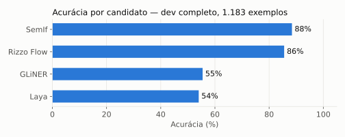
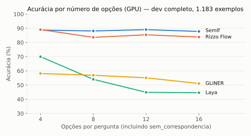
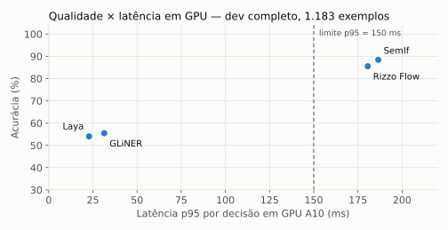
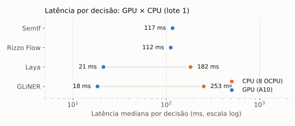

# Desenvolvimento — partição completa (1.183 exemplos)

## Sumário executivo

A rodada de desenvolvimento executou os quatro candidatos sobre toda a partição de dev, sem calibração. É a primeira medição em escala do benchmark e a referência para comparar com a calibração e com o teste final.

- **Qualidade:** **SemIf 88,4%** e **Rizzo Flow 85,5%** de acurácia, com macro F1 de 90,1% e 88,3%. **GLiNER (55,5%)** e **Laya (54,0%)** ficam cerca de 30 p.p. atrás, e a ordem se mantém em relação ao piloto.
- **Robustez ao número de opções:** SemIf fica estável entre 4 e 16 opções (88–89%); Rizzo varia entre 84% e 89%; o **Laya cai de 70% para 45%** quando as opções passam de 4 para 16.
- **Pedidos sem correspondência:** SemIf reconhece 78% deles; GLiNER, 62%, mas à custa de marcar 242 pedidos válidos como `sem_correspondencia`; Rizzo, 60%; Laya, 28%.
- **Latência:** em GPU A10, Laya e GLiNER ficam em cerca de 20 ms de mediana (p95 de 23 a 31 ms); SemIf e Rizzo, em cerca de 115 ms (p95 de 181 a 187 ms, acima do limite de 150 ms). Em CPU, Laya e GLiNER levam de 180 a 250 ms.
- **Execução:** 1.183 decisões por candidato e dispositivo, sem erros e sem truncamento.

## Resultados gerais

| Candidato | Acurácia | Macro F1 | `sem_correspondencia` reconhecido | Acerto dentro do escopo | Pedidos válidos marcados como `sem_correspondencia` | p50 GPU | p95 GPU |
|---|---|---|---|---|---|---|---|
| SemIf | 88,4% | 90,1% | 78,2% | 91,5% | 32 | 117 ms | 187 ms |
| Rizzo Flow | 85,5% | 88,3% | 59,6% | 93,4% | 6 | 112 ms | 181 ms |
| GLiNER | 55,5% | 55,3% | 61,5% | 53,6% | 242 | 18 ms | 31 ms |
| Laya | 54,0% | 56,4% | 28,0% | 61,9% | 37 | 21 ms | 23 ms |

**Acurácia por perfil de escrita (GPU)**

| Perfil | SemIf | Rizzo Flow | GLiNER | Laya |
|---|---|---|---|---|
| Curto e neutro | 88,2% | 87,5% | 58,3% | 66,0% |
| Informal, com abreviações | 92,7% | 88,5% | 60,4% | 55,7% |
| Erros de digitação | 89,0% | 82,8% | 50,2% | 49,8% |
| Regionalismo | 84,9% | 87,2% | 63,7% | 60,9% |
| Emocional | 92,2% | 85,5% | 47,5% | 45,8% |
| Longo, com contexto | 92,5% | 85,8% | 67,5% | 56,7% |
| Indireto ou com várias intenções | 78,2% | 81,7% | 43,7% | 45,8% |

## Resultados detalhados

Probabilidades brutas. Lote 1. As latências excluem os 5 primeiros exemplos (aquecimento). SemIf e Rizzo Flow rodam só em GPU, porque são inviáveis em CPU pela regra do piloto.

<!-- TABELA:INICIO -->
| Candidato | Disp. | Precisão | n | Acurácia | Macro F1 | ECE (bruto) | p50 ms | p95 ms | p99 ms | Carga s | RAM pico MiB | GPU pico MiB | Erros | Truncados |
|---|---|---|---|---|---|---|---|---|---|---|---|---|---|---|
| gliner | cpu | float32 | 1183 | 55.5% | 55.3% | 0.088 | 252.5 | 478.6 | 586.9 | 20.1 | 3258 | — | 0 | 0 |
| gliner | cuda | float32 | 1183 | 55.5% | 55.3% | 0.088 | 18.4 | 31.4 | 33.5 | 21.8 | 3228 | 1959 | 0 | 0 |
| laya | cpu | float32 | 1183 | 54.4% | 56.8% | 0.287 | 182.3 | 225.6 | 269.5 | 9.6 | 2679 | — | 0 | 0 |
| laya | cuda | float32 | 1183 | 54.0% | 56.4% | 0.290 | 21.3 | 22.8 | 24.0 | 8.6 | 2788 | 1811 | 0 | 0 |
| rizzo_flow | cuda | gguf-q8_0 | 1183 | 85.5% | 88.3% | 0.035 | 111.8 | 180.6 | 184.7 | 6.2 | 4529 | 5115 | 0 | 0 |
| semif | cuda | bfloat16 | 1183 | 88.4% | 90.1% | 0.042 | 117.1 | 186.5 | 190.1 | 7.8 | 9028 | 8513 | 0 | 0 |
<!-- TABELA:FIM -->

Arquivos: `summary-<candidato>-<dispositivo>.json` (resumo, cenário, precisão e diagnósticos) e `predictions-<candidato>-<dispositivo>.jsonl` (uma linha por exemplo, com a distribuição completa de probabilidades e os metadados do exemplo).

## Metodologia

**Dados.** A partição de desenvolvimento do conjunto congelado `d1-v1` inteira, sem amostragem: 1.183 exemplos de 99 lotes de geração, com os 43 rótulos. São 178 pedidos fora de escopo, 98 exemplos com a intenção correta fora das opções (rótulo `sem_correspondencia`) e opções por pergunta assim distribuídas: 4 (320), 8 (311), 12 (274) e 16 (278). A partição é disjunta da de calibração e da de teste por lote de geração.

**Tarefa e execução.** Classificação de intenção (D1) pelo contrato `jev-compat-v1`, com a mesma entrada para todos. Lote 1, precisão nativa de cada candidato e inferência isolada de fontes externas, com artefatos verificados por SHA-256. Nenhuma calibração nem limiar foi aplicado nesta rodada (tarefa 59).

**Cenário.** GPU `VM.GPU.A10.1` em sa-saopaulo-1 para os quatro candidatos; CPU `VM.Standard.E4.Flex` com 8 OCPU em us-chicago-1 para Laya e GLiNER. Mais detalhes em [docs/05](../../docs/05-cenario-de-execucao.md).

**Uso desta rodada.** O dev serve de referência e de diagnóstico. Os parâmetros que vão para o teste (temperatura e limiar) vêm exclusivamente da [partição de calibração](../calibration/README.md); nada aqui foi usado para ajustá-los.

## Conclusão

1. **Dois grupos bem separados.** Os modelos de 4B (SemIf e Rizzo Flow) ficam entre 85% e 89% de acurácia; os encoders compactos (Laya e GLiNER), entre 54% e 56%. A distância de cerca de 30 p.p. se confirma na escala completa.
2. **O SemIf é o mais robusto.** Mantém a acurácia com qualquer número de opções e em quase todos os perfis de escrita; seu ponto fraco são os pedidos indiretos ou com várias intenções (78%).
3. **O Laya depende de poucas opções.** Com 4 opções, chega a 70%; com 12 ou mais, cai para 45%. É viável só com uma elegibilidade que restrinja bem as opções.
4. **O GLiNER abstém demais.** Reconhece bem os pedidos sem correspondência, mas descarta 242 pedidos válidos (20% do escopo), o que no orquestrador viraria desambiguação desnecessária.
5. **A latência separa os mesmos grupos.** Os encoders cabem com folga no limite de p95 em GPU e são viáveis em CPU; os modelos de 4B, não.
