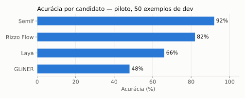
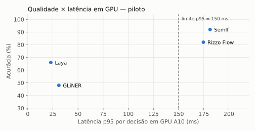
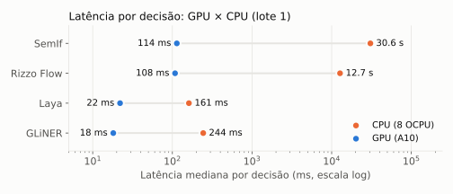

# Piloto — 50 exemplos de desenvolvimento por candidato

## Sumário executivo

O piloto validou, de ponta a ponta, a execução dos quatro candidatos sobre a mesma amostra de 50 enunciados de atendimento de telefonia móvel, em CPU e em GPU. Não houve erros de execução nem truncamento de entrada, e nenhum parâmetro operacional precisou de ajuste.

- **Qualidade:** os dois modelos de 4B parâmetros lideram. O **SemIf** acertou **92%** e o **Rizzo Flow** **82–86%**. Os encoders compactos ficaram abaixo: **Laya** com 66% e **GLiNER** com 48%.
- **Abstenção:** o SemIf reconheceu 10 de 12 pedidos sem intenção correspondente; o Laya, 4 de 12. Esse é o comportamento que evita rotas erradas no orquestrador.
- **Latência em GPU A10:** Laya e GLiNER respondem em cerca de **20 ms**; SemIf e Rizzo, em cerca de **110 ms** de mediana. Mas o **p95 dos modelos de 4B (175–181 ms) fica acima do limite pré-registrado de 150 ms**.
- **CPU:** só Laya e GLiNER são viáveis (p95 de 0,2 a 0,5 s). SemIf e Rizzo levam de 13 a 31 s por decisão e ficam fora das rodadas em CPU.
- **Leitura preliminar:** há um *trade-off* claro entre qualidade e latência, que a rodada completa de desenvolvimento, a calibração e o teste final (1.744 exemplos) vão quantificar com intervalos de confiança.

## Resultados gerais

| Candidato | Acertos dentro do escopo (38) | `sem_correspondencia` reconhecido (12) | Escopo marcado como `sem_correspondencia` |
|---|---|---|---|
| SemIf | 36 | 10 | 2 |
| Rizzo Flow | 34 | 7 | 2 |
| Laya | 29 | 4 | 0 |
| GLiNER | 19 | 5 | 11 |

*(GPU A10. Em CPU os números coincidem, exceto o Rizzo Flow, que acerta 2 casos a mais: os backends CPU e CUDA do llama.cpp não são numericamente idênticos.)*

## Resultados detalhados

Lote 1. As latências excluem os 5 primeiros exemplos (aquecimento). ECE calculado sobre as probabilidades brutas, ainda sem calibração.

<!-- TABELA:INICIO -->
| Candidato | Disp. | Precisão | n | Acurácia | Macro F1 | ECE (bruto) | p50 ms | p95 ms | p99 ms | Carga s | RAM pico MiB | GPU pico MiB | Erros | Truncados |
|---|---|---|---|---|---|---|---|---|---|---|---|---|---|---|
| gliner | cpu | float32 | 50 | 48.0% | 43.9% | 0.198 | 244.0 | 481.0 | 511.6 | 21.0 | 3257 | — | 0 | 0 |
| gliner | cuda | float32 | 50 | 48.0% | 43.9% | 0.198 | 18.1 | 31.0 | 32.7 | 21.5 | 3256 | 1681 | 0 | 0 |
| laya | cpu | float32 | 50 | 66.0% | 63.5% | 0.252 | 161.3 | 200.5 | 220.7 | 9.3 | 2673 | — | 0 | 0 |
| laya | cuda | float32 | 50 | 66.0% | 63.5% | 0.266 | 22.0 | 23.0 | 23.2 | 9.1 | 2773 | 1811 | 0 | 0 |
| rizzo_flow | cpu | gguf-q8_0 | 50 | 86.0% | 87.5% | 0.095 | 12734.4 | 18693.6 | 19293.6 | 4.0 | 4936 | — | 0 | 0 |
| rizzo_flow | cuda | gguf-q8_0 | 50 | 82.0% | 84.3% | 0.103 | 108.1 | 174.7 | 182.5 | 5.3 | 4527 | 5107 | 0 | 0 |
| semif | cpu | bfloat16 | 50 | 92.0% | 93.9% | 0.079 | 30633.4 | 47585.7 | 49344.0 | 6.3 | 9137 | — | 0 | 0 |
| semif | cuda | bfloat16 | 50 | 92.0% | 93.9% | 0.114 | 113.8 | 181.3 | 183.7 | 6.7 | 9020 | 8513 | 0 | 0 |
<!-- TABELA:FIM -->

Arquivos: `summary-<candidato>-<dispositivo>.json` (resumo da execução, com cenário, precisão e diagnósticos) e `predictions-<candidato>-<dispositivo>.jsonl` (uma linha por exemplo, com a distribuição de probabilidades completa).

## Metodologia

**Amostra.** São 50 exemplos sorteados com seed fixa (20261007) da partição de desenvolvimento do conjunto congelado `d1-v1`. Os candidatos recebem os mesmos exemplos, na mesma ordem.

| Característica | Composição da amostra |
|---|---|
| Intenções distintas | 29 das 42 da taxonomia |
| Rótulo `sem_correspondencia` | 12: 8 pedidos fora de escopo e 4 com a intenção correta fora das opções |
| Opções por pergunta | 4 (15 exemplos) · 8 (14) · 12 (9) · 16 (12) |
| Perfis de escrita | informal/abreviado (12), erros de digitação (11), curto/neutro (8), regionalismo (8), emocional (5), indireto/várias intenções (5), longo (1) |

**Tarefa.** Classificação de intenção (D1): para cada enunciado, o candidato escolhe uma opção entre as intenções elegíveis do exemplo mais `sem_correspondencia`, pelo contrato `POST /v1/systemone` (`jev-compat-v1`).

**Execução.** Lote 1 e sem paralelismo; cada candidato na sua precisão nativa (fp32 para Laya e GLiNER, bf16 para SemIf, GGUF Q8_0 para Rizzo Flow). Inferência isolada de fontes externas, com artefatos verificados por SHA-256.

**Cenário.** CPU em us-chicago-1 (`VM.Standard.E4.Flex`, 8 OCPU, 64 GB). GPU em sa-saopaulo-1 (`VM.GPU.A10.1`). Mais detalhes em [docs/05](../../docs/05-cenario-de-execucao.md).

**Limites desta etapa.** Com 50 exemplos, cada ponto percentual de acurácia corresponde a meio exemplo, e os intervalos de confiança são largos (cerca de ±13 p.p. a 95%). O piloto serve para validar a execução e dar a ordem de grandeza, não para ranquear.

## Conclusão

1. **Execução validada.** Os quatro candidatos rodam isolados, sem erros e sem truncamento, com a mesma entrada e o mesmo contrato, em CPU e em GPU. O piloto não exigiu ajuste operacional; o orçamento interno de opções do Laya foi verificado e mantido no padrão.
2. **CPU restrita aos encoders.** Pela regra pré-registrada (p95 ≤ 10 s), SemIf e Rizzo Flow ficam fora das rodadas em CPU.
3. **Sinal de qualidade.** Os modelos de 4B lideram em acurácia e em abstenção correta. Entre os compactos, o Laya acerta mais dentro do escopo, mas quase não abstém; o GLiNER marca muitos pedidos válidos como `sem_correspondencia`.
4. **Sinal de latência.** Em GPU, só Laya e GLiNER cumprem o p95 ≤ 150 ms. SemIf e Rizzo ficam perto do limite (cerca de 110 ms de mediana), mas acima dele no p95.
5. **Próximos passos.** Rodada completa de desenvolvimento (1.183 exemplos), calibração das probabilidades e escolha de limiares de abstenção (1.127 exemplos), congelamento da configuração e teste final (1.744 exemplos), com intervalos de confiança e cortes por perfil e número de opções.
