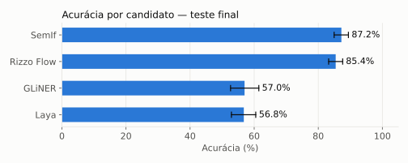
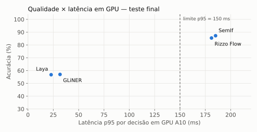
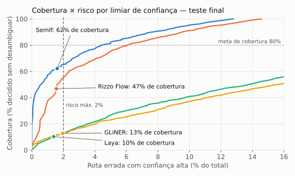
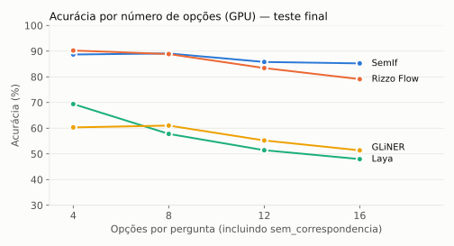
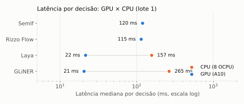

# Teste final — 1.744 exemplos, configuração congelada

## Sumário executivo

O teste final mediu os quatro candidatos sobre a partição de teste congelada, com a configuração, a calibração e os limiares fixados antes de qualquer acesso ao teste (tag `congelamento-d1-v1`). Cada medição foi repetida três vezes.

- **Qualidade:** **SemIf 87,2%** (IC 95%: 85,0–89,4) e **Rizzo Flow 85,4%** (83,2–87,6) **empatam estatisticamente**: a diferença de 1,8 p.p. tem intervalo que inclui zero. Os dois superam **GLiNER (57,0%)** e **Laya (56,8%)** por cerca de 30 p.p., com alta significância.
- **Critério de qualidade (H1, macro F1 ≥ 0,80):** atendido pelo SemIf (0,889) e pelo Rizzo Flow (0,877); não atendido por Laya (0,590) e GLiNER (0,580).
- **Critério de latência (H3, p95 ≤ 150 ms em GPU A10):** atendido por Laya (23 ms) e GLiNER (32 ms); **não atendido** pelo SemIf (187 ms) nem pelo Rizzo Flow (181 ms).
- **Critério de risco (H2, cobertura ≥ 80% com ≤ 2% de rotas erradas com confiança alta):** **nenhum candidato atende**. Com os limiares congelados, o SemIf decide sozinho 62% dos casos com 97,4% de acerto, e o Rizzo Flow 47% com 96,7%.
- **Custo:** em GPU A10, cerca de **US$ 0,07 por mil decisões** para os modelos de 4B e **US$ 0,012** para os encoders. Em CPU, o Laya custa US$ 0,013 por mil decisões.
- **Principal causa de erro grave:** quando a intenção correta não está entre as opções elegíveis, os modelos escolhem a opção mais próxima em vez de `sem_correspondencia`. É a maior classe de rotas erradas com confiança alta e aponta uma mudança de arquitetura (ver Conclusão).
- **Reprodutibilidade:** as predições são idênticas nas três repetições, e o desvio-padrão da latência p95 fica abaixo de 2 ms em GPU.

## Resultados gerais

| Candidato | Acurácia (IC 95%) | Macro F1 | `sem_correspondencia` reconhecido | Cobertura no limiar congelado | Acurácia nos casos decididos | Rotas erradas com confiança alta | p50 / p95 GPU | Vazão GPU | Custo GPU por mil decisões |
|---|---|---|---|---|---|---|---|---|---|
| SemIf | **87,2%** (85,0–89,4) | 0,889 | 76,7% | 62,2% | 97,4% | 1,6% | 121 / 187 ms | 7,8/s | US$ 0,071 |
| Rizzo Flow | **85,4%** (83,2–87,6) | 0,877 | 62,4% | 46,8% | 96,7% | 1,5% | 115 / 181 ms | 7,9/s | US$ 0,070 |
| GLiNER | 57,0% (52,6–61,5) | 0,580 | 58,7% | 12,8% | 84,8% | 1,9% | 21 / 32 ms | 46,0/s | US$ 0,012 |
| Laya | 56,8% (52,9–60,5) | 0,590 | 28,6% | 10,3% | 86,6% | 1,4% | 22 / 23 ms | 45,9/s | US$ 0,012 |

**Critérios pré-registrados** ([Q5](../../docs/04-decisoes-de-projeto.md#q5--critérios-de-sucesso-pré-registrados))

| Candidato | H1 · macro F1 ≥ 0,80 | H2 · cobertura ≥ 80% com risco ≤ 2% | H3 · p95 ≤ 150 ms em GPU |
|---|---|---|---|
| SemIf | ✅ 0,889 | ❌ 62,2% | ❌ 187 ms |
| Rizzo Flow | ✅ 0,877 | ❌ 46,8% | ❌ 181 ms |
| GLiNER | ❌ 0,580 | ❌ 12,8% | ✅ 32 ms |
| Laya | ❌ 0,590 | ❌ 10,3% | ✅ 23 ms |

*(O baseline LLM previsto na Q9 não foi executado neste ciclo; por isso H1 usa o critério absoluto de macro F1.)*

**Comparações pareadas contra o SemIf (GPU)**

| Candidato | Diferença de acurácia (IC 95%, bootstrap por lote) | Acertos só do SemIf / só do candidato | McNemar (p) |
|---|---|---|---|
| Rizzo Flow | +1,8 p.p. (−0,5 a +4,2) | 127 / 96 | 0,044 |
| GLiNER | +30,2 p.p. (+26,1 a +34,3) | 603 / 76 | < 10⁻¹⁰⁰ |
| Laya | +30,5 p.p. (+26,5 a +34,6) | 605 / 74 | < 10⁻¹⁰⁰ |

O McNemar trata cada exemplo como independente. Com o bootstrap por lote de geração, que respeita o agrupamento, a diferença entre SemIf e Rizzo Flow não é robusta.

**Classes de erro (GPU, tarefa 73)**

| Classe | SemIf | Rizzo Flow | GLiNER | Laya |
|---|---|---|---|---|
| Intenção correta fora das opções (escolheu a mais próxima) | 84 | 106 | 88 | 128 |
| Par difícil da taxonomia | 62 | 69 | 100 | 182 |
| Pedido válido marcado como `sem_correspondencia` | 49 | 10 | 329 | 61 |
| Ambiguidade (anotação dividida ou com várias intenções) | 17 | 18 | 46 | 71 |
| Pedido fora de escopo aceito como intenção | 4 | 35 | 66 | 140 |
| Linguagem (erros de digitação, regionalismo, informalidade) | 3 | 8 | 56 | 82 |
| Desempenho do modelo (sem outra causa identificada) | 4 | 8 | 65 | 90 |
| **Total de erros** | **223** | **254** | **750** | **754** |

**Erros de alto impacto (tarefa 72).** São as rotas erradas acima do limiar de confiança: 28 no SemIf e 27 no Rizzo Flow. A inspeção manual mostra três padrões:
1. **Intenção fora das opções** (12 no SemIf, 20 no Rizzo). O pedido é claro, mas a intenção certa não estava entre as elegíveis, e o modelo escolhe a vizinha com alta confiança. Por exemplo, "Quero fazer portabilidade do meu número para outra operadora", com `portabilidade` fora das opções, vira `troca_numero`; "tem algum pacote de roaming?" vira `roaming_duvida`.
2. **Pares difíceis da taxonomia** (8 no SemIf). Exemplos: cobrança de roaming lida como contestação de fatura; cancelar uma assinatura lido como contestar a cobrança.
3. **Rótulos discutíveis.** Alguns casos têm duas leituras razoáveis, como "Estou sem internet e preciso saber se ainda tenho saldo" (`internet_consumo` ou `recarga_saldo`). Isso reflete o limite de uma referência anotada por modelos.

Listas completas em `errors-high-impact-<candidato>-<dispositivo>.jsonl`; matrizes de confusão em `confusion-<candidato>-<dispositivo>.csv`.

## Resultados detalhados

**Por execução** (três repetições por candidato e dispositivo; probabilidades brutas; latências sem os 5 exemplos de aquecimento)

<!-- TABELA:INICIO -->
| Candidato | Disp. | Precisão | n | Acurácia | Macro F1 | ECE (bruto) | p50 ms | p95 ms | p99 ms | Carga s | RAM pico MiB | GPU pico MiB | Erros | Truncados |
|---|---|---|---|---|---|---|---|---|---|---|---|---|---|---|
| gliner | cpu r1 | float32 | 1744 | 57.0% | 57.9% | 0.099 | 265.1 | 468.2 | 520.2 | 19.7 | 3272 | — | 0 | 0 |
| gliner | cpu r2 | float32 | 1744 | 57.0% | 57.9% | 0.099 | 272.9 | 490.7 | 550.1 | 19.7 | 3257 | — | 0 | 0 |
| gliner | cpu r3 | float32 | 1744 | 57.0% | 57.9% | 0.099 | 264.0 | 485.0 | 541.3 | 20.2 | 3276 | — | 0 | 0 |
| gliner | cuda r1 | float32 | 1744 | 57.0% | 57.9% | 0.099 | 20.6 | 31.6 | 33.8 | 21.6 | 3255 | 1807 | 0 | 0 |
| gliner | cuda r2 | float32 | 1744 | 57.0% | 57.9% | 0.099 | 20.6 | 31.7 | 33.7 | 21.6 | 3277 | 1807 | 0 | 0 |
| gliner | cuda r3 | float32 | 1744 | 57.0% | 57.9% | 0.099 | 21.2 | 31.7 | 34.0 | 21.8 | 3254 | 1807 | 0 | 0 |
| laya | cpu r1 | float32 | 1744 | 56.8% | 59.0% | 0.269 | 156.9 | 190.4 | 240.6 | 9.3 | 2682 | — | 0 | 0 |
| laya | cpu r2 | float32 | 1744 | 56.8% | 59.0% | 0.269 | 158.7 | 198.9 | 261.8 | 8.3 | 2682 | — | 0 | 0 |
| laya | cpu r3 | float32 | 1744 | 56.8% | 59.0% | 0.269 | 175.2 | 213.3 | 268.6 | 9.4 | 2689 | — | 0 | 0 |
| laya | cuda r1 | float32 | 1744 | 56.8% | 59.0% | 0.271 | 21.5 | 22.9 | 25.0 | 9.4 | 2794 | 1811 | 0 | 0 |
| laya | cuda r2 | float32 | 1744 | 56.8% | 59.0% | 0.271 | 21.9 | 23.4 | 24.5 | 10.8 | 2795 | 1811 | 0 | 0 |
| laya | cuda r3 | float32 | 1744 | 56.8% | 59.0% | 0.271 | 21.7 | 23.3 | 25.8 | 9.3 | 2791 | 1811 | 0 | 0 |
| rizzo_flow | cuda r1 | gguf-q8_0 | 1744 | 85.4% | 87.7% | 0.037 | 114.6 | 181.1 | 185.6 | 5.3 | 4532 | 5115 | 0 | 0 |
| rizzo_flow | cuda r2 | gguf-q8_0 | 1744 | 85.4% | 87.7% | 0.037 | 114.7 | 181.1 | 185.3 | 5.8 | 4535 | 5115 | 0 | 0 |
| rizzo_flow | cuda r3 | gguf-q8_0 | 1744 | 85.4% | 87.7% | 0.037 | 114.7 | 180.3 | 185.1 | 5.3 | 4533 | 5115 | 0 | 0 |
| semif | cuda r1 | bfloat16 | 1744 | 87.2% | 88.9% | 0.042 | 119.5 | 185.1 | 187.9 | 7.1 | 9029 | 8513 | 0 | 0 |
| semif | cuda r2 | bfloat16 | 1744 | 87.2% | 88.9% | 0.042 | 121.0 | 188.0 | 190.7 | 7.2 | 9029 | 8513 | 0 | 0 |
| semif | cuda r3 | bfloat16 | 1744 | 87.2% | 88.9% | 0.042 | 121.6 | 188.2 | 190.8 | 7.7 | 9028 | 8513 | 0 | 0 |
<!-- TABELA:FIM -->

**Desempenho consolidado** (média ± desvio-padrão das três repetições)

| Candidato | Disp. | p50 ms | p95 ms | Vazão (decisões/s) | Custo por mil decisões | Carga s | RAM pico | GPU pico | Pesos | Ambiente |
|---|---|---|---|---|---|---|---|---|---|---|
| SemIf | GPU | 120,7 ± 1,1 | 187,1 ± 1,8 | 7,8 | US$ 0,071 | 7,3 | 8,8 GiB | 8,3 GiB | 8,7 GiB | 4,0 GiB |
| Rizzo Flow | GPU | 114,7 ± 0,1 | 180,8 ± 0,4 | 7,9 | US$ 0,070 | 5,4 | 4,4 GiB | 5,0 GiB | 4,1 GiB | 0,6 GiB |
| GLiNER | GPU | 20,8 ± 0,4 | 31,7 ± 0,1 | 46,0 | US$ 0,012 | 21,6 | 3,2 GiB | 1,8 GiB | 1,1 GiB | 4,0 GiB |
| GLiNER | CPU | 267,3 ± 4,9 | 481,3 ± 11,7 | 3,6 | US$ 0,023 | 19,9 | 3,2 GiB | — | 1,1 GiB | 4,0 GiB |
| Laya | GPU | 21,7 ± 0,2 | 23,2 ± 0,3 | 45,9 | US$ 0,012 | 9,8 | 2,7 GiB | 1,8 GiB | 0,6 GiB | 4,0 GiB |
| Laya | CPU | 163,6 ± 10,1 | 200,9 ± 11,6 | 6,5 | US$ 0,013 | 9,0 | 2,6 GiB | — | 0,6 GiB | 4,0 GiB |

Vazão por instância com lote 1 (1 / latência média). Custo = preço público por hora do shape × tempo médio por decisão ([config/pricing.yaml](../../config/pricing.yaml): A10 a US$ 2,00/h; E4 com 8 OCPU e 64 GB a US$ 0,296/h). O ambiente inclui PyTorch com CUDA, exceto no Rizzo Flow, que usa llama.cpp.

**Acurácia por corte (GPU)**

| Corte | SemIf | Rizzo Flow | GLiNER | Laya |
|---|---|---|---|---|
| 4 opções (451) | 88,7% | 90,2% | 60,3% | 69,4% |
| 8 opções (431) | 89,1% | 88,9% | 61,0% | 57,8% |
| 12 opções (422) | 85,8% | 83,4% | 55,2% | 51,4% |
| 16 opções (440) | 85,2% | 79,1% | 51,4% | 48,0% |
| Pedido dentro do escopo (1.508) | 85,6% | 85,5% | 54,8% | 59,4% |
| Pedido fora de escopo (236) | 97,5% | 84,8% | 71,2% | 39,8% |
| Intenção correta fora das opções (142) | 40,9% | 24,6% | 38,0% | 9,2% |
| Curto e neutro | 90,4% | 89,2% | 56,2% | 60,2% |
| Informal, com abreviações | 86,6% | 85,2% | 60,7% | 59,3% |
| Erros de digitação | 88,6% | 84,7% | 49,6% | 57,0% |
| Regionalismo | 93,6% | 87,6% | 62,0% | 53,6% |
| Emocional | 85,8% | 85,4% | 60,8% | 58,6% |
| Longo, com contexto | 86,9% | 86,9% | 60,2% | 55,4% |
| Indireto ou com várias intenções | 78,7% | 78,7% | 48,1% | 53,1% |

Todos os cortes, por candidato e dispositivo, estão em [`analysis.json`](analysis.json).

## Metodologia

**Dados.** A partição de teste do conjunto congelado `d1-v1` inteira, sem amostragem: 1.744 exemplos de 146 lotes de geração, com os 43 rótulos. São 236 pedidos fora de escopo, 142 exemplos com a intenção correta fora das opções e opções por pergunta distribuídas entre 4 (451), 8 (431), 12 (422) e 16 (440). A partição é disjunta da de desenvolvimento e da de calibração por lote de geração, e ficou congelada (SHA-256) antes de qualquer ajuste. O tamanho atende à análise de poder pré-registrada (≥ 1.300 decisões, [Q12](../../docs/04-decisoes-de-projeto.md#q12--tamanho-do-conjunto-de-teste-final)).

**Configuração congelada.** Contrato `jev-compat-v1`, adaptadores, partições, temperatura e limiar de cada candidato ficaram fixos em `config/frozen.json` antes da abertura do teste (tarefa 62). O executor só abre a partição de teste se todos os hashes conferirem.

**Execução.** Lote 1 (o lote de produção, [Q6](../../docs/04-decisoes-de-projeto.md#q6--lote-de-produção)), precisão nativa de cada candidato e inferência isolada de fontes externas. Três repetições independentes por candidato e dispositivo, cada uma num job novo. GPU `VM.GPU.A10.1` (sa-saopaulo-1) para os quatro; CPU `VM.Standard.E4.Flex` com 8 OCPU e 64 GB (us-chicago-1) para Laya e GLiNER, os viáveis em CPU.

**Métricas** (`analysis/report.py`, tarefas 67–74):
- **Qualidade:** acurácia, macro F1, precisão e revocação macro, e matriz de confusão, calculadas na repetição 1. As três repetições têm predições idênticas.
- **Incerteza:** IC 95% por bootstrap agrupado por lote de geração (2.000 reamostragens). Comparações pareadas com bootstrap da diferença e McNemar exato.
- **Calibração e abstenção:** probabilidades calibradas com a temperatura congelada; cobertura e rotas erradas com confiança alta medidas no limiar congelado.
- **Desempenho:** latência média ± desvio entre as três repetições, vazão por instância, pico de RAM e de GPU, armazenamento de pesos e ambiente, e custo por mil decisões a preço público.
- **Erros:** classificação automática por regras (par difícil da taxonomia, intenção fora das opções, ambiguidade de anotação, perfil de linguagem etc.) e inspeção manual das rotas erradas acima do limiar.

## Conclusão

1. **Qualidade: os modelos de 4B vencem com folga.** SemIf e Rizzo Flow acertam cerca de 86% das decisões e são os únicos que atendem ao critério de qualidade; entre eles, a diferença não é estatisticamente robusta. Os encoders compactos ficam cerca de 30 p.p. abaixo.
2. **Latência: os encoders vencem.** Laya e GLiNER respondem em cerca de 20 ms em GPU e são viáveis em CPU. Os modelos de 4B passam do limite de p95 de 150 ms na A10 (181 a 187 ms).
3. **Nenhum candidato cumpre os três critérios ao mesmo tempo**, e nenhum atinge a meta de abstenção (80% de cobertura com risco ≤ 2%).
4. **Recomendação para o orquestrador:**
   - **Modelo de decisão:** **SemIf** como primeira opção, pela maior acurácia, pelo melhor reconhecimento de pedidos sem correspondência (77%) e pela maior cobertura com risco controlado (62%). **Rizzo Flow** é a alternativa equivalente em qualidade, com metade da memória de GPU (5 GiB contra 8,3 GiB) e menos falsas abstenções.
   - **Latência:** para cumprir o p95 de 150 ms, avaliar uma GPU mais rápida que a A10 ou otimizações de inferência (quantização, compilação, cache do prefixo da pergunta). Na A10, a mediana já fica em cerca de 120 ms.
   - **Elegibilidade depois da classificação:** classificar contra o catálogo completo de intenções e aplicar a elegibilidade depois, de forma determinística, em vez de oferecer ao modelo só as opções elegíveis. Isso remove a maior classe de erros de alto impacto (intenção fora das opções).
   - **Abstenção:** usar o limiar calibrado para encaminhar à desambiguação os casos de baixa confiança (cerca de 38% com o SemIf), com 97% de acerto nos casos decididos.
   - **Encoders compactos:** Laya e GLiNER não servem como roteador principal neste domínio. Podem atuar como filtro rápido de primeira camada, se combinados com um modelo de 4B nos casos incertos.
5. **Limitações:** os dados são sintéticos e os rótulos vêm do consenso de três modelos generativos; não houve baseline LLM neste ciclo; a latência foi medida em uma única GPU (A10) e com lote 1; o Rizzo Flow roda em Q8_0 enquanto os demais rodam na precisão nativa.
